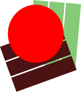

# RSVP

**RSVP stands for Rapid Serial Visual Presentation. It is a technique designed to increase reading speed by changing how words are presented to the eye.**

[Report Bug](https://github.com/rachelannec/RSVP/issues/new?labels=bug&template=bug_report.md) | [Request Feature](https://github.com/rachelannec/RSVP/issues/new?labels=enhancement&template=feature_request.md)

